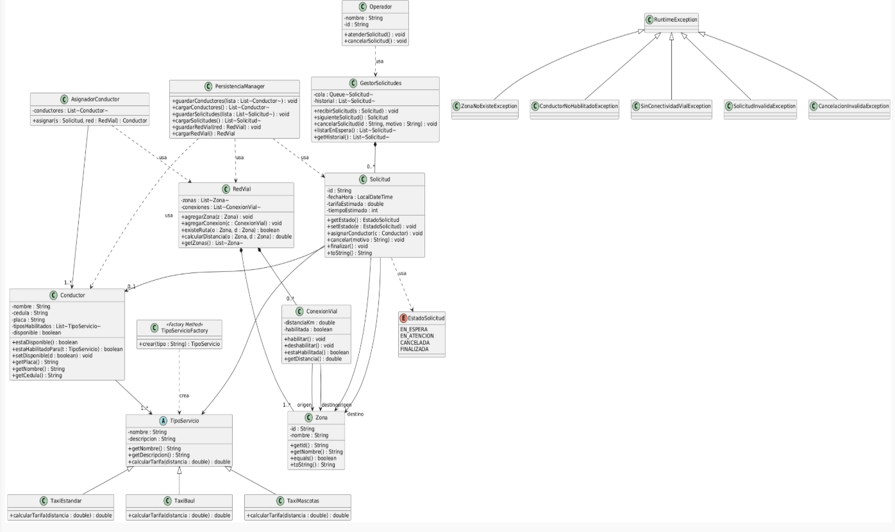
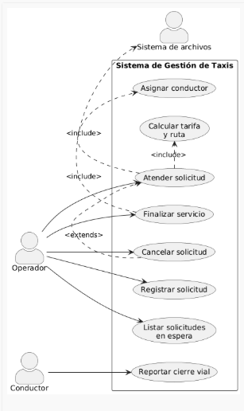

#  Sistema de Gestión de Taxis — Cooperativa Multizona


> Proyecto de la materia **Programación Orientada a Objetos** · 2026

---

##  Descripción

Sistema de gestión de servicios para una cooperativa de taxis multizona. Permite recibir, gestionar y asignar solicitudes de servicio considerando zonas geográficas, conectividad vial dinámica, tipos de servicio y disponibilidad de conductores.

El énfasis del proyecto está en el modelado y diseño orientado a objetos: principios SOLID, patrón Factory Method, manejo de excepciones personalizadas y persistencia en archivos.

---

##  Requisitos funcionales implementados

- [x] Registro de solicitudes con zona origen, destino, tipo de servicio y fecha/hora
- [x] Cola de espera ordenada por llegada (FIFO) con listado y cancelación justificada
- [x] Asignación automática de conductor disponible y habilitado para el tipo de servicio
- [x] Verificación de conectividad vial habilitada antes de asignar
- [x] Cálculo de tarifa estimada según distancia y tipo de servicio (base $5.000 COP)
- [x] Cierre de servicio por finalización exitosa o cancelación del usuario
- [x] Historial de solicitudes con estado final, conductor, tiempos y tarifa
- [x] Reporte de cierres viales por conductores con efecto inmediato en asignaciones
- [x] Persistencia: carga al iniciar y guardado en operaciones clave

---

##  Diseño orientado a objetos

### Pilares POO aplicados

| Pilar | Aplicación en el proyecto |
|---|---|
| **Abstracción** | `TipoServicio` es una clase abstracta que define el contrato de cada tipo de taxi |
| **Encapsulación** | Atributos privados en todas las entidades con acceso controlado por getters/setters |
| **Herencia** | `TaxiEstandar`, `TaxiBaul` y `TaxiMascotas` extienden `TipoServicio` |
| **Polimorfismo** | `calcularTarifa(distancia)` se comporta diferente según el tipo de taxi |

### Patrón de diseño — Factory Method

`TipoServicioFactory` centraliza la creación de instancias de `TipoServicio` según el tipo solicitado, desacoplando la lógica de asignación del tipo concreto de taxi.

```java
TipoServicio servicio = TipoServicioFactory.crear("MASCOTAS");
```

### Principios SOLID

- **S — Single Responsibility**: `Conductor` solo representa datos; `AsignadorConductor` tiene la lógica de asignación.
- **O — Open/Closed**: Agregar un nuevo tipo de taxi no requiere modificar código existente, solo una nueva subclase.
- **D — Dependency Inversion**: La lógica de negocio depende de abstracciones, no de implementaciones concretas.

### Excepciones personalizadas

```
ZonaNoExisteException
ConductorNoHabilitadoException
SinConectividadVialException
SolicitudInvalidaException
CancelacionInvalidaException
```

---

##  Estructura del proyecto

```
taxi-cooperativa/
│
├── src/main/java/com/taxicooperativa/
│   ├── model/          ← Entidades del dominio (Conductor, Solicitud, Zona...)
│   ├── service/        ← Lógica de negocio (AsignadorConductor, GestorSolicitudes...)
│   ├── persistence/    ← Lectura y escritura de archivos
│   ├── exception/      ← Excepciones personalizadas
│   └── ui/             ← Interfaz de usuario
│
├── docs/
│   └── uml/
│       ├── diagrama-clases-v01.png
│       ├── diagrama-casos-uso-v01.png
│       └── casos-uso-descripcion.md
│
├── data/               ← Archivos de persistencia (.txt)
├── .gitignore
└── README.md
```

---

##  Instrucciones de ejecución

**Requisitos:** Java 17 o superior.

```bash
# 1. Clonar el repositorio
git clone https://github.com/tu-usuario/taxi-cooperativa.git
cd taxi-cooperativa

# 2. Compilar
javac -d out src/main/java/com/taxicooperativa/**/*.java

# 3. Ejecutar
java -cp out com.taxicooperativa.ui.Main
```

---

##  Diagramas UML

### Diagrama de Clases v0.1


### Diagrama de Casos de Uso v0.1


> Ver descripción textual completa de los 8 casos de uso en [`docs/uml/casos-uso-descripcion.md`](docs/uml/casos-uso-descripcion.md)

---

##  Evidencias de prueba

> *Capturas y resultados de prueba se agregarán en el seguimiento de la semana 16.*

---

##  Equipo

| Integrante | GitHub |
|---|---|
| Christopher Alexandro Moran Rodriguez | [@Menteenblanc0](https://github.com/Menteenblanc0) |

---

*Universidad del Magdalena· Materia: Programación Orientada a Objetos · 2026*
